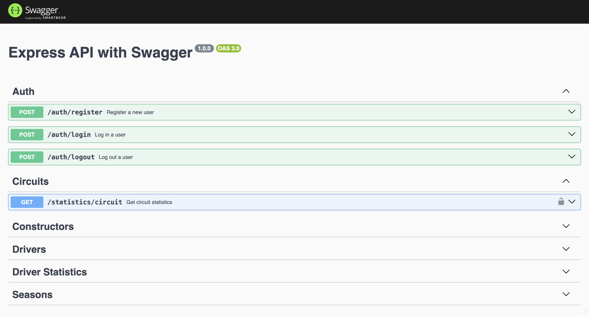
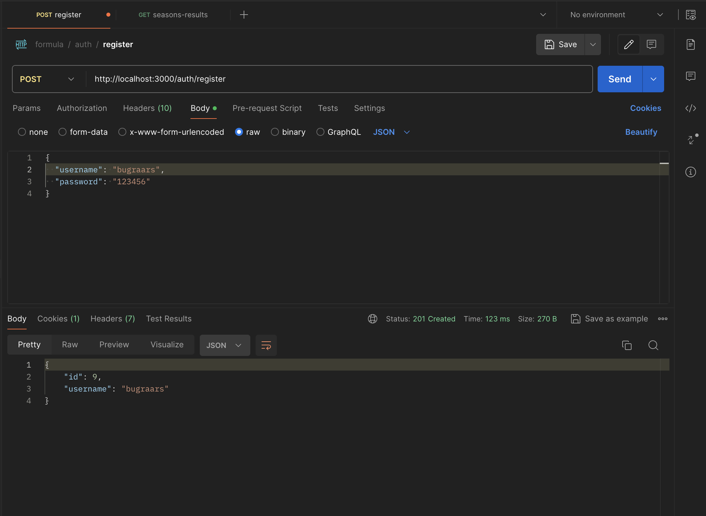

# Formula Projesi
Bu proje, Formula 1 verilerini yönetmek için bir REST API sağlar
Ayrıca formula.postman_collection.json dosyasını, postman'a import ederek test edebilirsiniz.

## Kurulum

Projenin bağımlılıklarını yüklemek için aşağıdaki komutu kullanabilirsiniz:

```sh 
npm install
```

Proje, çevre değişkenlerini bir .env dosyasından okur. Aşağıda bir örnek .env dosyası bulunmaktadır:

```sh
URL=http://localhost:3000
DB_PORT = 5432
DB_HOST = localhost
DB_USER = 'postgres'
DB_PASS =  '123456'
DB_DATABASE = 'formula_one_db'
JWT_SECRET = "formula1"
```

## Kullanılan Kütüphaneler
bcrypt: A library to help you hash passwords.
cookie-parser: Parse Cookie header and populate req.cookies with an object keyed by the cookie names.
csv-parser: A streaming csv parser inspired by binary-csv that aims to be faster than everyone else.
dotenv: Loads environment variables from a .env file into process.env.
express: Fast, unopinionated, minimalist web framework for Node.js.
express-validator: An express.js middleware for validator.
jsonwebtoken: An implementation of JSON Web Tokens.
pg: Non-blocking PostgreSQL client for Node.js. Pure JavaScript and optional native libpq bindings.
swagger-jsdoc: Generates swagger doc based on JSDoc.
swagger-ui-express: Swagger UI Express Middleware.
ts-node: TypeScript execution and REPL for node.js, with source map support.
nodemon: A tool that helps develop node.js based applications by automatically restarting the node application when file changes in the directory are detected.

## Proje Yapısı
```sh
.
├── .DS_Store
├── .env
├── .gitignore
├── app.ts
├── data/
│   ├── .DS_Store
│   ├── csv/
│   │   ├── circuits.csv
│   │   ├── constructor_results.csv
│   │   ├── constructor_standings.csv
│   │   ├── constructors.csv
│   │   ├── driver_standings.csv
│   │   ├── drivers.csv
│   │   ├── lap_times.csv
│   │   ├── pit_stops.csv
│   │   ├── qualifying.csv
│   │   ├── races.csv
│   │   ├── results.csv
│   │   ├── seasons.csv
│   │   └── sprint_results.csv
│   └── init.sql
├── init.ts
├── package.json
├── readme
├── src/
│   └── api/
│       └── v1/
│           ├── config/
│           │   └── db.connection.ts
│           ├── controllers/
│           ├── middleware/
│           ├── models/
│           ├── routes/
│           └── sql/
├── tsconfig.json
└── types/
    └── express/
        └── index.d.ts
```


